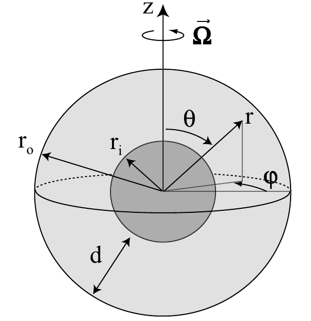

.. _secEquations:

Formulation of the (magneto)-hydrodynamics problem
##################################################

The general equations describing thermal convection and dynamo action of a
rotating compressible fluid are the starting point from which the Boussinesq or
the anelastic approximations are developed.  In MagIC, we consider a spherical
shell rotating about the vertical :math:`z` axis with a constant angular
velocity :math:`\Omega`. Equations are solve in the corotating system. 

The conservation of momentum is formulated by the Navier-Stokes equation 

.. math::
   \rho\left(\dfrac{\partial \vec{u}}{\partial t}+ \vec{u}\cdot\vec{\nabla}\
   \vec{u} \right) =-\vec{\nabla} p +
   \dfrac{1}{\mu_0}(\vec{\nabla}\times\vec{B})\times\vec{B} +\rho
   \vec{g}-2\rho\vec{\Omega}\times\vec{u}+ \vec{\nabla}\cdot\mathsf{S},
   :label: eqNS

where :math:`\vec{u}` is the velocity field, :math:`\vec{B}` the magnetic field, 
and :math:`p` a modified pressure that includes centrifugal forces. 
:math:`\mathsf{S}` corresponds to the rate-of-strain tensor given by:

.. math::
   \begin{aligned}
   S_{ij} & = 2\nu\rho\left[e_{ij}-\dfrac{1}{3}\delta_{ij}\,\vec{\nabla}\cdot\vec{u} \right], \\
   e_{ij} & =\dfrac{1}{2}\left(\dfrac{\partial u_i}{\partial x_j}+\dfrac{\partial
   u_j}{\partial x_i}\right).
   \end{aligned}
   
Convection is driven by buoyancy forces acting on variations in density :math:`\rho`. 
These variations have a dynamical part formulated by the continuity equation 
describing the conservation of mass:

.. math::
   \dfrac{\partial \rho}{\partial t} = - \vec{\nabla} \cdot \rho \vec{u}.
   :label: eqContinuity
   
In addition an equation of state is required to formulate the thermodynamic 
density changes. For example the relation 

.. math::
  \dfrac{1}{\rho} \partial \rho = -\alpha \partial T + \beta \partial p - \delta \partial \xi 
  :label: EOS1

describes density variations caused by variations in temperature :math:`T`,
pressure :math:`p`, and composition :math:`\xi`. The latter contribution needs
to be considered for describing the effects of light elements released from a
growing solid iron core in a so-called double diffusive approach. 

To close the system we also have to formulate the dynamic changes of entropy,
pressure, and composition.  The evolution equation for pressure can be derived
from the Navier-Stokes equation, as will be further discussed below. For
entropy variations we use the so-called energy or heat equation 

.. math::
  \rho T\left(\dfrac{\partial s}{\partial t}+\vec{u}\cdot \vec{\nabla} s \right) = 
  \vec{\nabla}\cdot (k\vec{\nabla} T) + \Phi_\nu +\lambda\left(\vec{\nabla}\times\vec{B}\right)^2 
  + \epsilon,
  :label: eqEntropy

where :math:`\Phi_\nu` corresponds to the viscous heating expressed by

.. math::
   \Phi_\nu = 2\rho\left[e_{ij}e_{ji}-\dfrac{1}{3}\left(\vec{\nabla}\cdot\vec{u}\right)^2\right]
   
Note that we use here the summation convention over the indices :math:`i` and
:math:`j`. The second last term on the right hand side is the Ohmic heating due
to electric currents. The last term is a volumetric sink or source term that
can describe various effects, for example radiogenic heating, the mixing-in  of
the light elements or, when radially dependent, potential variations in the
adiabatic gradient (see below). 
For chemical composition, we finally use

.. math::
  \rho \left(\dfrac{\partial \xi}{\partial t}+\vec{u}\cdot \vec{\nabla} \xi \right) = 
  \vec{\nabla}\cdot(k_\xi \vec{\nabla} \xi) + \epsilon_\xi,
  :label: eqXi

The induction equation is obtained from the Maxwell equations (ignoring
displacement current) and Ohm's law (neglecting Hall effect):

.. math::
  \dfrac{\partial \vec{B}}{\partial t} = \vec{\nabla} \times \left( \vec{u}\times\vec{B}-\lambda\,\vec{\nabla}\times\vec{B}\right).
  :label: eqInduction
  
When the magnetic diffusivity :math:`\lambda` is homogeneous this simplifies to
the commonly used form

.. math::
  \dfrac{\partial \vec{B}}{\partial t} = \vec{\nabla} \times \left( \vec{u}\times\vec{B} \right) 
  + \lambda\,\vec{\Delta}\vec{B}.
  :label: eqInduction2
  
The physical properties determining above equations are rotation rate
:math:`\Omega`, the kinematic viscosity :math:`\nu`, the magnetic permeability
:math:`\mu_0`, gravity :math:`\vec{g}`, thermal conductivity :math:`k`, Fick's
conductiviy :math:`k_\xi`, magnetic diffusivity :math:`\lambda`. The latter
connects to the electrical conductivity :math:`\sigma` via :math:`\lambda =
1/(\mu_0\sigma)`.  The thermodynamics properties appearing in :eq:`EOS1` are
the thermal expansivity at constant pressure (and composition) 
 
.. math:: \alpha = \dfrac{1}{\rho}\left(\dfrac{\partial\rho}{\partial T}\right)_{p,\xi}, 
   :label: alpha

the compressibility at constant temperature  

.. math::
   \beta = \dfrac{1}{\rho}\left(\dfrac{\partial\rho}{\partial p}\right)_{T,\xi}
 
and an equivalent parameter :math:`\delta` for the dependence of 
density on composition:

.. math::
   \delta = \dfrac{1}{\rho}\left(\dfrac{\partial\rho}{\partial \xi}\right)_{p,T},
   :label: delta

   Sketch of the spherical shell model and its system of coordinate.
   
   
The reference state
===================

The convective flow and the related processes including magnetic field generation constitute 
only small disturbances around a background or reference state. In the following we denote the background 
state with a tilde and the disturbance we are interested in with a prime. 
Formally we will solve equations in first order of a smallness parameters :math:`\epsilon` which 
quantified the ratio of convective disturbances to background state:

.. math:: \epsilon \sim \dfrac{T'}{\tilde{T}} \sim \dfrac{p'}{\tilde{p}} \sim \dfrac{\rho'}{\tilde{\rho}} \sim  ... \ll 1 .
   :label: epsilon

The background state is hydrostatic, i.e. obeys the simple force balance

.. math:: \nabla \tilde{p} = \tilde{\rho} \tilde{\vec{g}}.
   :label: hydrostatic 

Convective motions are supposed to be strong enough to provide homogeneous entropy 
(and composition). The reference state is thus adiabatic and its gradients can be 
expressed in terms of the pressure gradient :eq:`hydrostatic`:

.. math:: \dfrac{\nabla\tilde{T}}{\tilde{T}} = \dfrac{1}{\tilde{T}} \left(\dfrac{\partial T}{\partial p}\right)_s 
          \nabla p = \dfrac{\alpha}{c_p} \tilde{\vec{g}} ,
          :label: nablaT
          
.. math:: \dfrac{\nabla\tilde{\rho}}{\tilde{\rho}} = \dfrac{1}{\tilde{\rho}} \left(\dfrac{\partial \rho}{\partial p}\right)_s 
          \nabla p = \beta \tilde{\rho} \tilde{\vec{g}} .   
          :label: nablarho

The reference state obviously dependence only on radius.      
Dimensionless numbers quantifying the temperature and density gradients are called dissipation number :math:`Di` and 
compressibility parameter :math:`Co` respectively: 

.. math:: Di = \dfrac{\alpha d}{c_p} \tilde{g},

and 

.. math:: Co = d \beta \tilde{\rho} \tilde{g}.

Here :math:`d` is a typical length scale, for example the shell thickness of the problem. 
The dissipation number is something like an inverse temperature scale hight while the 
compressibility parameters is an inverse density scale hight. 
The ratio of both numbers also helps to quantify the relative impact of temperature and 
pressure on density variations: 

.. math:: \dfrac{\alpha \nabla T}{\beta \nabla \rho} \approx \alpha \tilde{T} \dfrac{Di}{Co}.
   :label: deltarho
   
As an example we demonstrate how to derive the first order continuity equation here. 
Using :math:`\rho=\tilde{\rho}+\rho'` in :eq:`eqContinuity` leads to

.. math:: \dfrac{\partial \tilde{\rho}}{\partial t} + \dfrac{\partial \rho'}{\partial t} 
           = - \vec{\nabla} \cdot \left( \tilde{\rho} \vec{u} \right)
             - \vec{\nabla} \cdot \left( \rho' \vec{u} \right).
   
The zero order term vanishes since the background density is considered static (or actually changing very slowly 
on very long time scales). The second term in the right hand side is obviously of second order. 
The ratio of the remaining two terms can be estimated to also be of first order in :math:`\epsilon`, meaning 
that the time derivative of :math:`\rho` is actually also of second order: 

.. math:: \dfrac{\left[\partial \rho /\partial t\right]}{\left[\vec{\nabla} \cdot \rho \vec{u}\right]} \approx
          \dfrac{\rho'}{\tilde{\rho}}\approx\epsilon\;\;.
          
Square brackets denote order of magnitude estimates here. 
We have used the fact that the reference state is 
static and assume time scale of changes are comparable (or slower) :math:`\rho'` than the time 
scales represented by :math:`u` and that length scales
associated to the gradient operator are not too small. 
We can then neglect local variations in :math:`\rho'` which means that sound waves are filtered out. 
This first order continuity equation thus simply reads:

.. math:: \vec{\nabla} \cdot \left( \tilde{\rho} \vec{u} \right) =  0.
      :label: eqContiuity1
      
This defines the so-called anelastic approximation where sound waves are filtered out by 
neglecting the local time derivative of density. This approximation is justified when
typical velocities are sufficiently smaller than the speed of sound. 

Boussinesq approximation
========================

For Earth the dissipation number and the compressibility parameter
are around :math:`0.2` when temperature and density jump over the whole liquid core 
are considered. This motivates the so called Boussinesq approximation where :math:`Di` and 
:math:`Co` are assumed to vanish. The continuity equation :eq:`eqContinuity` then simplifies further:

.. math:: \dfrac{1}{\tilde{\rho}} \vec{\nabla} \cdot \tilde{\rho} \vec{u} = \dfrac{\vec{u}}{\tilde{\rho}} \cdot \nabla \tilde{\rho} 
   + \nabla\cdot\vec{u} \approx \nabla\cdot\vec{u} = 0.

When using typical number for Earth, :eq:`deltarho` becomes :math:`0.05` so that pressure effects on density may be neglected. 
The first order Navier-Stokes equation (after to zero order hydrostatic reference solution has been subtracted) then reads:

.. math::
   \tilde{\rho}\left(\dfrac{\partial \vec{u}}{\partial t}+ \vec{u}\cdot\vec{\nabla}\
   \vec{u} \right) =-\vec{\nabla} p' -2\rho\vec{\Omega}\times\vec{u}
   + \alpha \tilde{g}_o T' \dfrac{\vec{r}}{r_o}
   + \delta \tilde{g}_o \xi' \dfrac{\vec{r}}{r_o}
   + \dfrac{1}{\mu_0}(\vec{\nabla}\times\vec{B})\times\vec{B} 
   + \tilde{\rho} \nu \Delta \vec{u}.
   :label: eqNSB

Here :math:`u` and :math:`B` are understood as first order disturbances and
:math:`p'` is the first order non-hydrostatic pressure and :math:`T'` the
super-adiabatic temperature and :math:`\xi` the super-adiabatic chemical
composition.  Above we have adopted a simplification of the buoyancy term.  In
the Boussinesq limit with vanishing :math:`Co` and a small density difference
between a solid inner and a liquid outer core a linear gravity dependence
provides a reasonable approximation:

.. math::
   \tilde{\vec{g}} = \tilde{g}_o \dfrac{\vec{r}}{r_o},
   
where we have chosen the gravity :math:`\tilde{g}_o` at the outer boundary
radius :math:`r_o` as reference.

The first order energy equation becomes 

.. math::
  \tilde{\rho}\left(\dfrac{\partial T'}{\partial t}+\vec{u}\cdot \vec{\nabla} T' \right) = 
  \kappa \Delta T'  + \epsilon,
  :label: eqEntropyB

where we have assumed a homogeneous :math:`k` and neglected viscous and Ohmic
heating which can be shown to scale with :math:`Di` as we discuss below.
Furthermore, we have used the simple relation

.. math::
  \partial s \approx \dfrac{\tilde{\rho} c_p}{\tilde{T}} \partial T,
  
defined the thermal diffusivity

.. math::
  \kappa = \dfrac{k}{\tilde{\rho} c_p},
  
and adjusted the definition of :math:`\epsilon`. Finally the first order equation
for chemical composition becomes

.. math::
  \tilde{\rho}\left(\dfrac{\partial \xi'}{\partial t}+\vec{u}\cdot \vec{\nabla} \xi' \right) = 
  \kappa_\xi \Delta \xi'  + \epsilon_\xi,
  :label: eqCompB

where we have assumed a homogeneous :math:`k_\xi` and adjusted the definition of :math:`\epsilon_\xi`.

MagIC solves a dimensionless form of the differential equations. Time is scaled
in units of the viscous diffusion time :math:`d^2/\nu`, length in units of the
shell thickness :math:`d`, temperature in units of the temperature drop
:math:`\Delta T=T_o-T_i` over the shell, composition in units of the composition
drop :math:`\Delta \xi = \xi_o-\xi_i` over the shell  and magnetic field in units
:math:`(\mu\lambda\tilde{\rho}\Omega)^{1/2}`.  Technically the transition to
the dimensionless form is achieved by the substitution 

.. math::
   r\rightarrow r\;d ,\quad t\rightarrow (d^2/\nu)\;t ,\quad
   T\rightarrow \Delta T\;T ,\quad \xi\rightarrow \Delta\xi\;\xi ,\quad 
   B\rightarrow \left(\mu\lambda\tilde{\rho}\Omega\right)^{1/2}B 
   
where :math:`r` stands for any length. The next step then is to collect the
physical properties as a few possible characteristic dimensionless numbers.
Note that many different scalings and combinations of dimensionless numbers are
possible. For the Navier-Stokes equation in the Boussinesq limit MagIC uses the
form:

.. math::
   \left(\dfrac{\partial \vec{u}}{\partial t}+ \vec{u}\cdot\vec{\nabla}\
   \vec{u} \right) =-\vec{\nabla} p' -\dfrac{2}{E}\vec{e_z}\times\vec{u}
   + \dfrac{Ra}{Pr} T' \dfrac{\vec{r}}{r_o}
   + \dfrac{Ra_\xi}{Sc} \xi' \dfrac{\vec{r}}{r_o}
   + \dfrac{1}{E Pm}(\vec{\nabla}\times\vec{B})\times\vec{B} 
   + \Delta \vec{u},
   :label: eqNSBoussinesq

where :math:`\vec{e}_z` is the unit vector in the direction of the rotation
axis and the meaning of the pressure disturbance :math:`p'` has been adjusted
to the new dimensionless equation form. 
  

Anelastic approximation
========================

The anelastic approximation adopts the simplified continuity :eq:`eqContiuity1`. 
The background state can be specified in different ways, for example by 
providing profiles based on internal models and/or ab initio simulations. 
We will assume a polytropic ideal gas in the following. 

Analytical solution in the limit of an ideal gas
------------------------------------------------

In the limit of an ideal gas which follows
:math:`\tilde{p}=\tilde{\rho}\tilde{T}` and has :math:`\alpha=1/\tilde{T}`, one
directly gets:

.. math::
   \begin{aligned}
   \dfrac{d \tilde{T}}{dr}  & = -Di\,\tilde{g}(r), \\
   \tilde{\rho} & = \tilde{T}^{1/(\gamma-1)},
   \end{aligned}

where :math:`\gamma=c_p/c_v`. Note that we have moved to a dimensionless 
formulations here, where all quantities have been normalized with their outer boundary values 
and :math:`Di` refers to the respective outer boundary value. 
If we in addition make the assumption of a
centrally-condensed mass in the center of the spherical shell of radius
:math:`r\in[r_i,r_o]`, i.e. :math:`g\propto, 1/r^2`, this leads to

.. math::
   \begin{aligned}
    \tilde{T}(r) & =Di\frac{r_o^2}{r}+(1-Di\,r_o), \\
    \tilde{\rho}(r) & = \tilde{T}^m, \\
    Di & = \dfrac{r_i}{r_o}\left(\exp\dfrac{N_\rho}{m}-1\right),
   \end{aligned}

where :math:`N_\rho=\ln(\tilde{\rho}_i/\tilde{\rho}_o)` is the number of density scale heights of the reference
state and :math:`m=1/(\gamma-1)` is the polytropic index.
   

.. warning:: * The relationship between :math:`N_\rho` and the dissipation number
               :math:`Di` directly depends on the gravity profile. The formula above
               is only valid when :math:`g\propto 1/r^2`.
             * In this formulation, when you change the polytropic index :math:`m`, you
               also change the nature of the fluid you're modelling since you accordingly
               modify :math:`\gamma=c_p/c_v`.

Anelastic MHD equations
-----------------------

In the most general formulation, all physical properties defining the
background state may vary with depth. Specific reference values must then be
chosen to provide a unique dimensionless formulations and we typically chose
outer boundary values here.  The exception is the magnetic diffusivity where we
adopt the inner boundary value instead.  The motivation is twofold: (i) it
allows an easier control of the possible continuous conductivity value in the
inner core; (ii) it is a more natural choice when modelling gas giants planets
which exhibit a strong electrical conductivity decay in the outer layer.

The time scale is then the viscous diffusion time :math:`d^2/\nu_o` where
:math:`\nu_o` is the kinematic viscosity at the outer boundary.  Magnetic field
is expressed in units of :math:`(\rho_o\mu_0\lambda_i\Omega)^{1/2}`, where
:math:`\rho_o` is the density at the outer boundary and :math:`\lambda_i` is
the magnetic diffusivity at the **inner** boundary.

This leads to the following sets of dimensionless equations:

.. math::
   \left(\dfrac{\partial \vec{u}}{\partial t}+\vec{u}\cdot\vec{\nabla}\vec{u}\right)
   = -\vec{\nabla}\left({\dfrac{p'}{\tilde{\rho}}}\right) - \dfrac{2}{E}\vec{e_z}\times\vec{u} 
   + \dfrac{Ra}{Pr}\tilde{g} \,s'\,\vec{e_r}
   + \dfrac{Ra_\xi}{Sc}\tilde{g} \,\xi'\,\vec{e_r}
   +\dfrac{1}{Pm\,E \,\tilde{\rho}}\left(\vec{\nabla}\times \vec{B} 
   \right)\times \vec{B}+ \dfrac{1}{\tilde{\rho}} \vec{\nabla}\cdot \mathsf{S},
   :label: eqNSNd

.. math::
   \vec{\nabla}\cdot\tilde{\rho}\vec{u}=0,
   :label: eqContNd

.. math::
   \vec{\nabla}\cdot\vec{B}=0,
   :label: eqMagNd

.. math::
  \tilde{\rho}\left(\dfrac{\partial \xi'}{\partial t} + 
  \vec{u}\cdot\vec{\nabla} \xi'\right) =
  \dfrac{1}{Sc}\vec{\nabla}\cdot\left(\kappa_\xi(r)\tilde{\rho}\vec{\nabla} \xi'\right)
  :label: eqCompNd

.. math::
   \dfrac{\partial \vec{B}}{\partial t} = \vec{\nabla} \times \left( \vec{u}\times\vec{B}\right)-\dfrac{1}{Pm}\vec{\nabla}\times\left(\lambda(r)\,\vec{\nabla}\times\vec{B}\right).
   :label: eqIndNd
   
Here :math:`\tilde{g}` and :math:`\tilde{\rho}` are
the normalized radial gravity and density profiles that reach one at the outer boundary. 

Entropy equation and turbulent diffusion
----------------------------------------

The entropy equation usually requires an additional assumption in most of the
existing anelastic approximations. Indeed, if one simply expands Eq.
:eq:`eqEntropy` with the classical temperature diffusion an operator of the
form:

.. math::
   \epsilon\,\vec{\nabla}\cdot \left( K \vec{\nabla} T'\right)+\vec{\nabla}\cdot \left( K \vec{\nabla} \tilde{T}\right),

will remain the right-hand side of the equation. At first glance, there seems
to be a :math:`1/\epsilon` factor between the first term and the second one,
which would suggest to keep only the second term in this expansion. However,
for astrophysical objects which exhibit strong convective driving (and hence
large Rayleigh numbers), the diffusion of the adiabatic background is actually
very small and may be comparable or even smaller in magnitude than the :math:`\epsilon`
terms representing the usual convective perturbations. For the Earth core for instance,
if one assumes that the typical temperature fluctuations are of the order of 1 mK and
the temperature contrast between the inner and outer core is of the order of 1000 K, then
:math:`\epsilon \sim 10^{-6}`. The ratio of the two terms can thus be estimated as

.. math:: \epsilon \dfrac{T'/\delta^2}{T/d^2},
   :label: eqEpsRatio

where :math:`d` is the thickness of the inner core and :math:`\delta` is the typical thermal
boundary layer thickness. This ratio is exactly one when :math:`\delta =1\text{ m}`, a
plausible value for the Earth inner core. 

In numerical simulations however, the over-estimated diffusivities restrict the
computational capabilities to much lower Rayleigh numbers. As a consequence,
the actual boundary layers in a global DNS will be much thicker and the ratio
:eq:`eqEpsRatio` will be much smaller than unity. The second terms will thus
effectively acts  as a radial-dependent heat source or sink that will drive or
hinder convection. This is one of the physical motivation to rather introduce a
**turbulent diffusivity** that will be approximated by

.. math:: \kappa \tilde{\rho}\tilde{T} \vec{\nabla} s,

where :math:`\kappa` is the turbulent diffusivity. **Entropy diffusion is assumed to dominate
over temperature diffusion in turbulent flows**.

The choice of the entropy scale to non-dimensionalize Eq. :eq:`eqEntropy` also
depends on the nature of the boundary conditions: it can be simply the entropy
contrast over the layer :math:`\Delta s` when the entropy is held constant at
both boundaries, or :math:`d\,(ds /dr)` when flux-based boundary conditions are
employed. We will restrict to the first option in the following, but keep in
mind that depending on your setup, the entropy reference scale (and thus the
Rayleigh number definition) might change.

.. math::
  \tilde{\rho}\tilde{T}\left(\dfrac{\partial s'}{\partial t} + 
  \vec{u}\cdot\vec{\nabla} s'\right) =
  \dfrac{1}{Pr}\vec{\nabla}\cdot\left(\kappa(r)\tilde{\rho}\tilde{T}\vec{\nabla} s'\right) +
  \dfrac{Pr\,Di}{Ra}\Phi_\nu +
  \dfrac{Pr\,Di}{Pm^2\,E\,Ra}\lambda(r)\left(\vec{\nabla}
  \times\vec{B}\right)^2,
  :label: eqEntropyNd
  
A comparison with :eq:`eqNSNd` reveals meaning of the different non-dimensional
numbers that scale viscous and Ohmic heating. The fraction :math:`Pr/Ra` simply
expresses the ratio of entropy and flow in the Navier-Stokes equation, while
the additional factor :math:`1/E Pm` reflects the scale difference of magnetic
field and flow.  Then remaining dissipation number :math:`Di` then expresses
the relative importance of viscous and Ohmic heating compared to buoyancy and
Lorentz force in the Navier-Stokes equation. For small :math:`Di`  both heating
terms can be neglected compared to entropy changes due to advection, an limit
that is used in the Boussinesq approximation. 

Dimensionless control parameters
================================

The equations :eq:`eqNSNd`-:eq:`eqEntropyNd` are governed by four dimensionless numbers: the
Ekman number

.. math::
   E = \frac{\nu}{\Omega d^2},
   :label: eqEkman

the thermal Rayleigh number

.. math::
   Ra = \frac{\alpha_o g_o T_o d^3 \Delta s}{c_p \kappa_o \nu_o},
   :label: eqRayleigh

the compositional Rayleigh number

.. math::
   Ra_\xi = \frac{\delta_o g_o d^3 \Delta \xi}{\kappa_\xi \nu_o},
   :label: eqRayleighxi

the Prandtl number

.. math::
   Pr = \frac{\nu_o}{\kappa_o},
   :label: eqPrandtl

the Schmidt number

.. math::
   Sc = \frac{\nu_o}{\kappa_\xi},
   :label: eqSchmidt

and the magnetic Prandtl number

.. math::
   Pm = \frac{\nu_o}{\lambda_i}.
   :label: eqmaPrandtl

In addition to these four numbers, the reference state is controlled by the geometry of
the spherical shell given by its radius ratio

.. math::
   \eta = \frac{r_i}{r_o},
   :label: eqRadratio

and the background density and temperature profiles, either controlled by :math:`Di` or
by :math:`N_\rho` and :math:`m`.

In the Boussinesq approximation all physical properties are assumed to 
be homogeneous and we can drop the sub-indices :math:`o`  and :math:`i` 
except for gravity. 
Moreover, the Rayleigh number can be expressed in terms of the temperature 
jump across the shell:

.. math::
   Ra = \frac{\alpha g_o d^3 \Delta T}{\kappa \nu}.
   :label: eqRayleighBoussinesq

.. seealso:: In MagIC, those control parameters can be adjusted in the 
             :ref:`&phys_param <secPhysNml>` section of the input namelist.

Variants of the non-dimensional equations and control parameters result from
different choices for the fundamental scales. For the length scale often
:math:`r_o` is chosen instead of :math:`d`. Other natural scales for time are the
magnetic or the thermal diffusion time, or the rotation period.
There are also different options for scaling the magnetic field strength.
The prefactor of two, which is retained in the
Coriolis term in :eq:`eqNSNd`, is often incorporated into the definition of the
Ekman number.

.. seealso:: Those references timescales and length scales can be adjusted by
             several input parameters in the :ref:`&control <secControlNml>` section
             of the input namelist.

Usual diagnostic quantities
---------------------------

Characteristic properties of the solution are usually expressed in terms
of non-dimensional diagnostic parameters.
In the context of the geodynamo for instance, the two
most important ones are the magnetic Reynolds number :math:`Rm` and
the Elsasser number :math:`\Lambda`. Usually the rms-values of the velocity
:math:`u_{rms}` and of the magnetic field :math:`B_{rms}` inside the spherical shell
are taken as characteristic values. The magnetic Reynolds number

.. math::
   Rm =  \frac{u_{rms}d}{\lambda_i}

can be considered as a measure for the flow velocity and describes
the ratio of advection of the magnetic field to magnetic diffusion.
Other characteristic non-dimensional numbers related to the flow velocity are
the (hydrodynamic) Reynolds number

.. math::
   Re = \frac{u_{rms} d}{\nu_o},

which measures the ratio of inertial forces to viscous forces,
and the Rossby number

.. math::
   Ro = \frac{u_{rms}}{\Omega d} ,

a measure for the ratio of inertial to Coriolis forces.

.. math::
   \Lambda = \frac{B_{rms}^2}{\mu_0\lambda_i\rho_o\Omega}

measures the ratio of Lorentz to Coriolis forces and is
equivalent to the square of the non-dimensional magnetic field strength
in the scaling chosen here.

.. seealso:: The time-evolution of these diagnostic quantities are stored in 
             the :ref:`par.TAG <secParFile>` file produced during the run of MagIC.

Boundary conditions and treatment of inner core
===============================================

Mechanical conditions
---------------------

In its simplest form, when modelling the geodynamo, the fluid shell is treated
as a container with rigid, impenetrable, and co-rotating walls. This implies
that within the rotating frame of reference all velocity components vanish at
:math:`r_o` and :math:`r_i`.  In case of modelling the free surface of a gas
giant planets or a star, it is preferable to rather replace the condition of
zero horizontal velocity by one of vanishing viscous shear stresses (the
so-called free-slip condition).

Furthermore, even in case of modelling the liquid iron core of a terrestrial
planet, there is no a priori reason why the inner core should necessarily
co-rotate with the mantle. Some models for instance allow for differential
rotation of the inner core and mantle with respect to the reference frame.  The
change of rotation rate is determined from the net torque. Viscous,
electromagnetic, and torques due to gravitational coupling between density
heterogeneities in the mantle and in the inner core contribute.

.. seealso:: The mechanical boundary conditions can be adjusted with the
             parameters :ref:`ktopv <secMechanicalBcs>` and
             :ref:`kbotv <secMechanicalBcs>` in the :ref:`&phys_param <secPhysNml>`
             section of the input namelist.

Magnetic boundary conditions and inner core conductivity
--------------------------------------------------------

When assuming that the fluid shell is surrounded by electrically insulating  regions
(inner core and external part),
the magnetic field inside the fluid shell matches continuously
to a potential field in both the exterior and the interior regions. Alternative
magnetic boundary conditions (like cancellation of the horizontal component of the field
) are also possible.

Depending on the physical problem you want to model, treating the inner core as an 
insulator is not realistic either, and it might instead be more appropriate to
assume that it has the same electrical conductivity as
the fluid shell. In this case, an equation equivalent to :eq:`eqIndNd` must
be solved for the inner core, where the velocity field simply
describes the solid body rotation of the inner core with respect to the reference frame.
At the inner core boundary a continuity condition for the magnetic field and the
horizontal component of the electrical field apply.

.. seealso:: The magnetic boundary conditions can be adjusted with the parameters
             :ref:`ktopb <secMagneticBcs>` and :ref:`kbotb <secMagneticBcs>`
             in the :ref:`&phys_param <secPhysNml>` section of the input namelist.

Thermal boundary conditions and distribution of buoyancy sources
----------------------------------------------------------------

In many dynamo models, convection is simply driven by an imposed fixed
super-adiabatic entropy contrast between the inner and outer boundaries.  This
approximation is however not necessarily the best choice, since for instance,
in the present Earth,  convection is thought to be driven by a combination of
thermal and compositional buoyancy.  Sources of heat are the release of latent
heat of inner core solidification and the secular cooling of the outer and
inner core, which can effectively be treated like a heat source.  The heat loss
from the core is controlled by the convecting mantle, which effectively imposes
a condition of fixed heat flux at the core-mantle boundary on the dynamo. The
heat flux is in that case spatially and temporally variable. 

.. seealso:: The thermal boundary conditions can be adjusted with the parameters
             :ref:`ktops <secThermalBcs>` and :ref:`kbots <secThermalBcs>`
             in the :ref:`&phys_param <secPhysNml>` section of the input namelist.

Chemical composition boundary conditions
----------------------------------------

They are treated in a very similar manner as the thermal boundary conditions

.. seealso:: The boundary conditions for composition can be adjusted with the parameters
             :ref:`ktopxi <secCompBcs>` and :ref:`kbotxi <secCompBcs>`
             in the :ref:`&phys_param <secPhysNml>` section of the input namelist.

