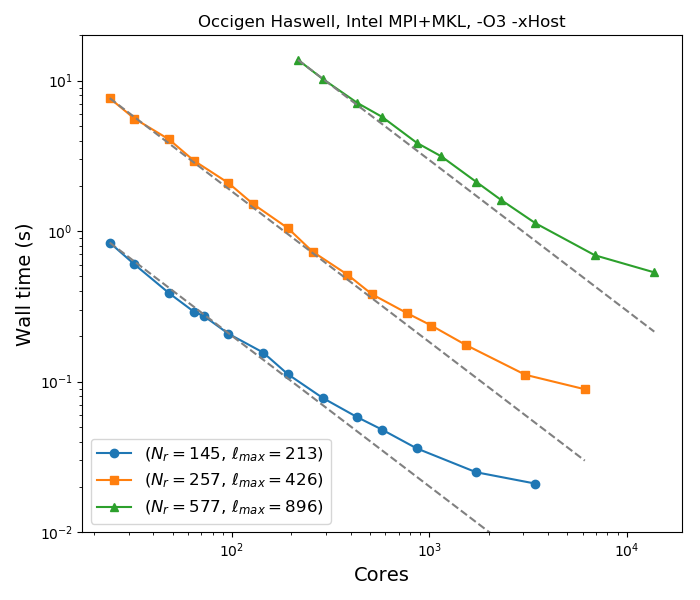

Introduction
############

Foreword
========

**MagIC** is a numerical code that can simulate fluid dynamics in a spherical
shell. MagIC solves for the Navier-Stokes equation including Coriolis force,
optionally coupled with an induction equation for Magneto-Hydro Dynamics (MHD),
a temperature (or entropy) equation and an equation for chemical composition
under both the anelastic and the Boussinesq approximations.

**MagIC** uses Chebyshev polynomials or finite difference in the radial direction and spherical
harmonic decomposition in the azimuthal and latitudinal directions. MagIC supports
several Implicit-Explicit time schemes where the nonlinear terms and the Coriolis force are treated explicitly, while the remaining linear terms are treated implicitly.

**MagIC** is written in Fortran and designed to be used on supercomputing
clusters.  It thus relies on a hybrid parallelisation scheme using both `OpenMP
<http://openmp.org/wp/>`_ and `MPI <http://www.open-mpi.org/>`_. Postprocessing
functions written in python (requiring `matplotlib <http://matplotlib.org/>`_
and `scipy <http://www.scipy.org/>`_) are also provided to allow a useful data
analysis.

   Mean walltime of the MagIC code on the supercomputer `Occigen
   <https://www.cines.fr/en/supercomputing-2/hardwares/the-supercomputer-occigen/>`_ 
   versus number of cores for a Boussinesq dynamo model computed at three 
   different numerical resolutions :math:`(N_r,\ell_{\text{max}})`. The dashed 
   grey lines show the ideal scalings.

**MagIC** is a free software. It can be used, modified and redistributed under the 
terms of the `GNU GPL v3 licence <http://www.gnu.org/licenses/gpl-3.0.en.html>`_.

Giving credit
=============

In case you intend to publish scientific results obtained with the MagIC code
or present them in a conference, we (the developers of MagIC) kindly
ask to be acknowledged with a reference to the website
https://magic-sph.github.io/ or https://github.com/magic-sph/magic.

We also suggest to give appropriate reference to one or several of the following
papers:

* Boussinesq equations: `Wicht (2002, PEPI, 132, 281-302) <http://dx.doi.org/10.1016/S0031-9201(02)00078-X>`_

* Anelastic equations: `Gastine & Wicht (2012, Icarus, 219, 28-442) <http://dx.doi.org/10.1016/j.icarus.2012.03.018>`_

* Boussinesq benchmark: `Christensen et al. (2001, PEPI, 128, 25-34) <http://dx.doi.org/10.1016/S0031-9201(01)00275-8>`_

* Benchmark for double diffusive convection: `Breuer et al. (2010, GJI, 183, 150-162) <http://dx.doi.org/11.1111/j.1365-246X.2010.04722.x>`_

* Anelastic benchmark: `Jones et al. (2011, Icarus, 216, 120-135) <http://dx.doi.org/10.1016/j.icarus.2011.08.014>`_

* In case you use the `SHTns <https://bitbucket.org/bputigny/shtns-magic>`_ library for the spherical harmonics transforms (MagIC 5.3 or later), please also cite: `Schaeffer (2013, GGG, 14, 751-758) <http://dx.doi.org/10.1002/ggge.20071>`_

.. seealso:: A (tentative) comprehensive list of the publications that have 
             been produced to date (May 2019) using **MagIC**
             is accessible `here <https://ui.adsabs.harvard.edu/public-libraries/LVt1vdaKQsC5P09In2iloA>`_.
             To date, more than **100 publications** have been-accepted in
             more than 10 different peer-reviewed journals: `PEPI
             <http://www.journals.elsevier.com/physics-of-the-earth-and-planetary-interiors/>`_
             (22), `Icarus <http://www.journals.elsevier.com/icarus/>`_ (11), `E&PSL
             <http://www.journals.elsevier.com/earth-and-planetary-science-letters/>`_ (7), `GJI
             <http://gji.oxfordjournals.org/>`_ (8), `A&A <http://www.aanda.org/>`_ (6), 
             `GRL <http://agupubs.onlinelibrary.wiley.com/agu/journal/10.1002/(ISSN)1944-8007/>`_ (4), 
             `JFM <http://journals.cambridge.org/action/displayJournal?jid=FLM>`_ (6), 
             `GAFD <http://www.tandfonline.com/toc/ggaf20/current>`_ (3),
             `Nature <http://www.nature.com/nature>`_ (2), etc.

.. figure:: figs/magic_pubs.png
   :scale: 50%
   :align: center
   :alt: caption

   Number of peer-reviewed publications produced using **MagIC**

