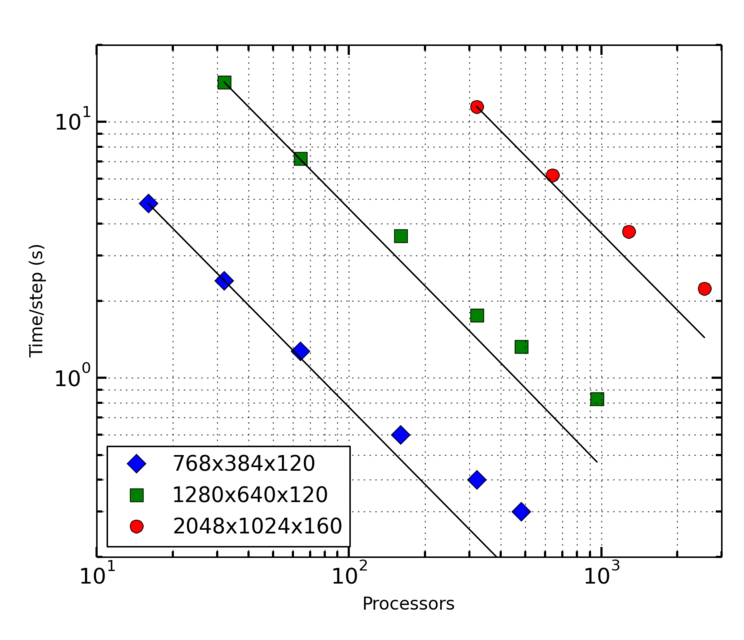

Foreword
########

**MagIC** is a numerical code that can simulate fluid dynamics in a spherical
shell. MagIC solves for the Navier-Stokes equation including Coriolis force,
optionally coupled with an induction equation for Magneto-Hydro Dynamics (MHD)
and a temperature (or entropy) equation under both the anelastic and the Boussinesq 
approximations.

**MagIC** uses Chebyshev polynomials in the radial direction and spherical
harmonic decomposition in the azimuthal and latitudinal directions. The
time-stepping scheme relies on a semi-implicit `Crank-Nicolson
<https://en.wikipedia.org/wiki/Crank–Nicolson_method>`_ for the linear terms of
the MHD equations and a `Adams-Bashforth
<https://en.wikipedia.org/wiki/Linear_multistep_method>`_ scheme for the
non-linear terms and the Coriolis force.

**MagIC** is written in Fortran and designed to be used on supercomputing
clusters.  It thus relies on a hybrid parallelisation scheme using both `OpenMP
<http://openmp.org/wp/>`_ and `MPI <http://www.open-mpi.org/>`_. Postprocessing
functions written in python (requiring `matplotlib <http://matplotlib.org/>`_
and `scipy <http://www.scipy.org/>`_) are also provided to allow a useful data
analysis.

   Mean walltime of the MagIC code on the supercomputer `stampede
   <https://www.tacc.utexas.edu/stampede/>`_ versus number of CPUs 
   for a dynamo model computed at three different numerical resolutions
   :math:`(N_\phi,N_\theta,N_r)`. The solid black lines show the ideal scalings.

**MagIC** is a free software. It can be used, modified and redistributed under the 
terms of the `GNU GPL v3 licence <http://www.gnu.org/licenses/gpl-3.0.en.html>`_.
